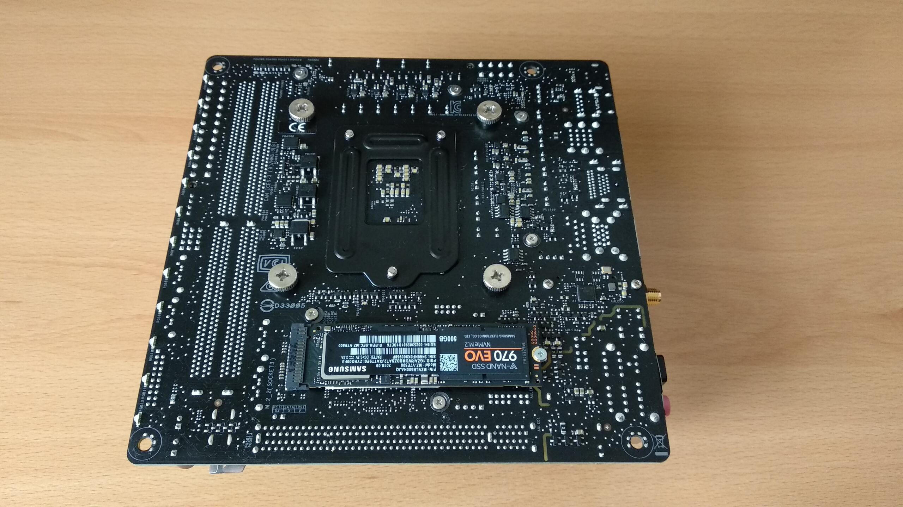
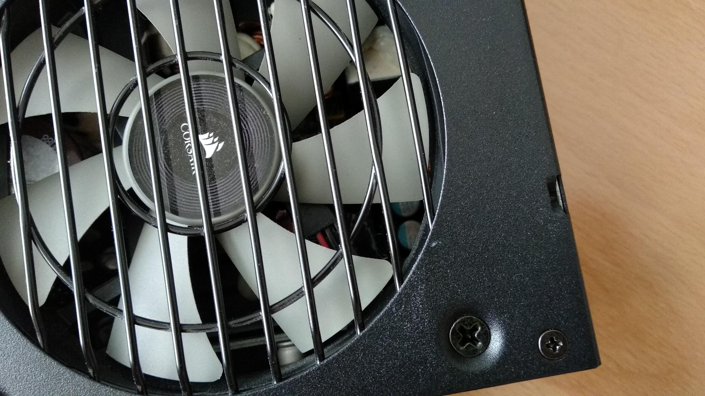
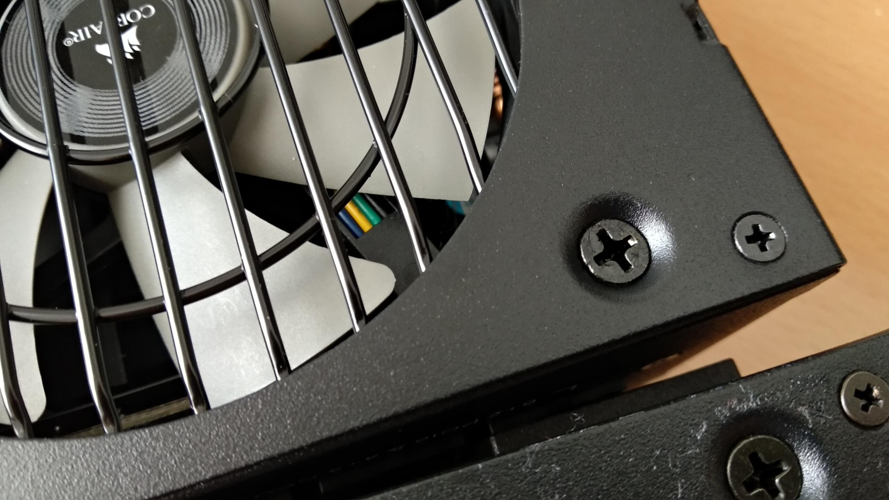
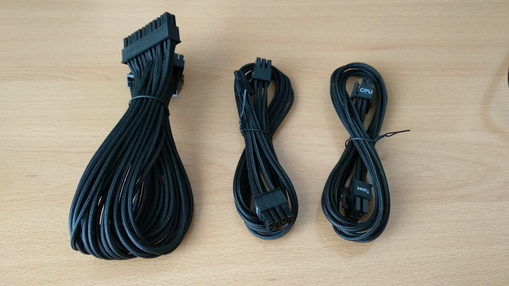
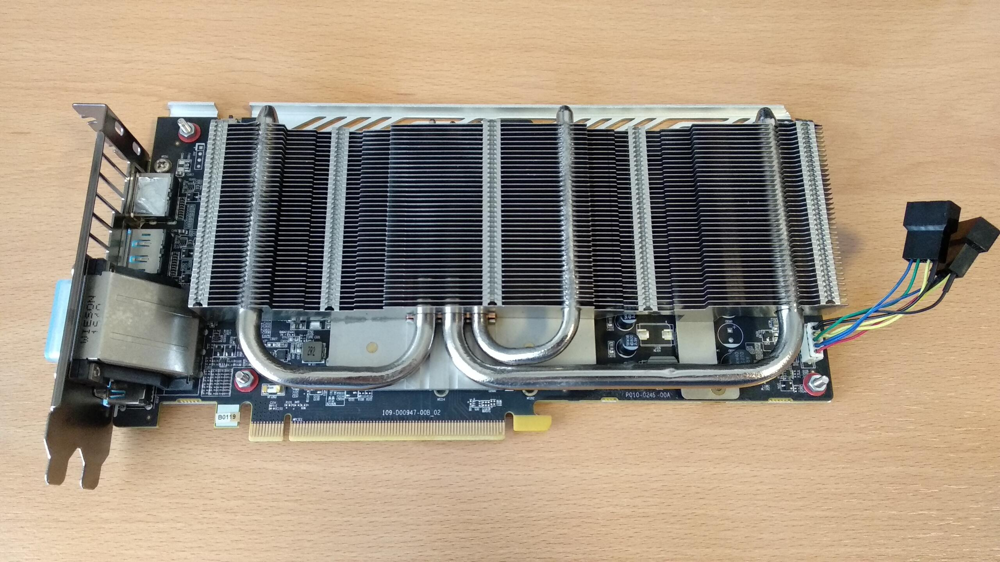
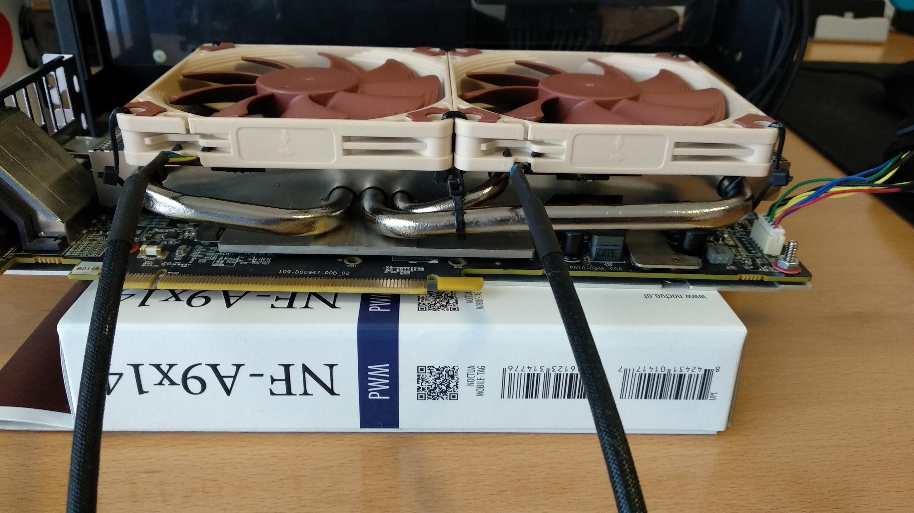
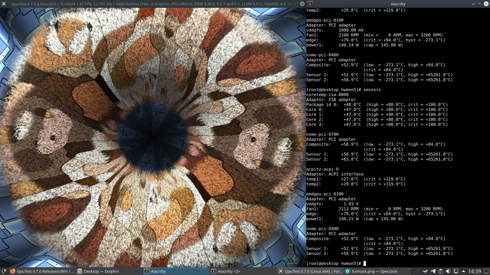

+++
date = 2020-03-21
title = "SFF PC"
description = "Building a Small Form Factor computer"
useRelativeCover = true
cover = "finished-pc-front.jpg"
images = ["/sff-pc/finished-pc-front.jpg"]
tags = ["pc"]
comments = true
+++

It was time to upgrade my desktop computer, and for this I wanted to assemble a PC as small and silent as possible, while keeping it relatively powerful and with enough space for a full-fledged graphics card.

The term Small Form Factor refers to desktop computers which use smaller size components in order to minimize their volume. To achieve that, these computers usually rely on form factors that are smaller than the typical ones. For example, they may use a mini-ITX motherboard instead of larger micro-ATX or ATX ones, a SFX power supply instead of an ATX one, smaller hard disk drives, and so on.

This reduction in size comes at a cost, though. Mini-ITX boards often have just one PCI-e expansion port and two DIMM sockets, so you are more limited in how many expansion cards you can put in. Also, most SFF cases prioritize being small rather than having a good airflow, so there are more difficulties to dissipate the heat and to reduce the noise. We will see how these challenges were faced.

## The hardware

I maintained some components of a previous build, while others were bought for this project.

### The motherboard

The motherboard was a new Asus ROG Strix Z270-I Gaming in the mini-ITX form factor. It was paired with an Intel i7-7700K and 16GB of RAM that I already had and a low-profile Noctua NH-L9i cooler.

The Noctua NH-L9i comes with a low profile NF-A9x14 fan that measures only 14mm in thickness:

I saved that fan for later usage with the graphics card. The space in the CPU side of the case would fit a fan with a larger thickness of up to 25mm, so the NF-A9x14 was replaced with a Noctua NF-B9 redux-1600 PWM fan:

The Noctua NF-B9 runs at lower RPMs (1600 vs 2200 at full speed) and provides similar or slightly better airflow than the NF-A9 at a lower noise.

This is important as the CPU fan speed will be regulated with the UEFI options which are quite conservative. They don't let you decrease the fan speed too much even when temperatures are low, so having a fan there that is silent even at high speeds was crucial.

### The disk drives

This time I wanted to use only solid state drives in the M2 form factor. In addition to their great speed, they have no moving parts and thus they are completely silent. They can also be installed directly into the M2 slots of the motherboard, avoiding the need to have the SATA data and power cables in the case.

The motherboard has space for two M2 drives. They both have the PCIe lines routed so they can be used at full PCIe x4 speed. One is at the top with a nice heatsink, the other at the bottom with no heatsink at all:

At first, I intended to fit one of them with a Samsung 970 EVO of 500GB for the operating systems and programs and the other with a cheaper Crucial MX500 of 1TB for further data storage:

The Crucial MX500 was fitted at the bottom of the motherboard, where it had no heatsink. When moving files around, the disk overheated, the thermal throttling went into action, and the speed was significantly reduced in order to maintain the temperature under safe limits. Flipping the disks around didn't help, the MX500 continued overheating even with the heatsink.

I'm not sure if the heatsink changes anything, actually. It comes with thermal pads that supposedly allow the heat transfer between the flash chips and the base of the heatsink, but the paper stickers on the disks won't allow to make a good thermal contact. I didn't want to remove these stickers as doing it may void the warranties of the disks.

After some testing, I became aware that the 970 EVO didn't have any problems with temperatures even on the bottom slot, so it seemed that the MX500 just normally generates more heat than the 970 EVO when in use. I had to return the MX500 and buy another 970 EVO, this one of 1TB. With this combination I didn't have more temperature issues even when stressing the disks.

### The power supply

At first, I went for the Corsair SF600 Gold power supply. Along with its small sister the SF450 Gold, they were two of the nicest power supplies available at the time in the SFX form factor. They have good voltage regulation, great efficiency, fully modular cables and a semi-passive fan.

After installing it, the PSU was working well but I wasn't happy with the fan noise. In practice, the PSU wasn't really semi-passive. Even at idle loads, the fan started moving and making noise.

There are two usual ways of regulating computer fans. The first one, typically used with 2-cable or 3-cable fans, is just varying the voltage supplied to the fan. More voltage means more speed, until the fans reaches its full speed at 12V. This is not the best method, as the curve between the applied voltage and the fan speed is not very linear. In fact, problems occur when applying too little voltage to the fan. Until a minimum voltage is reached, the fan doesn't have enough power to start moving at all.

After some googling, it became evident that these PSUs were using the varying voltage method. This increases the minimum achievable speed of the fan. Having the 600W version of the PSU didn't help either, as it had a more agressive fan curve than the 450W version. So, even with too little load, the fan was always moving at noisy speeds.

Just a few months later, Corsair released new revisions of these PSUs, called the SF600 Platinum and the SF450 Platinum. There were only minor differences between the new Platinum versions and the old Gold ones. The PSUs were mostly the same, the Gold ones were already almost good enough to meet Platinum certification requirements, but the fan system was improved and changed to a 4-cable fan with PWM controlled speed.

In this other method of fan speed control, the fan is always supplied with a 12V constant voltage, and the fan speed is regulated varying the duty cycle of a PWM signal. This is way better, especially when running the fan at very low speeds. It seems that you can make the fan run lower applying short 12V pulses than applying a continuous lower voltage.

As the system didn't really need all the power the SF600 Gold offered, I replaced it with a SF450 Platinum and the reduction in noise was huge. The SF450 Platinum also has a far more silent curve than the SF600 Gold, and the fan doesn't move at all even at light game-playing loads.

The Platinum versions also came with better looking sleeved cables:

For more information about these power supplies I recommend the reviews from JonnyGuru:

* [SF600 Gold](https://www.jonnyguru.com/blog/2016/07/04/corsair-sf600-gold-power-supply/)
* [SF450 Gold](https://www.jonnyguru.com/blog/2016/08/22/corsair-sf450-450w-power-supply/)
* [SF600 Platinum](https://www.jonnyguru.com/blog/2018/11/06/corsair-sf600-platinum-power-supply/)

### The graphics card

The graphics card is a Sapphire RX 480 NITRO+ 8GB that I already had from a previous build. I wanted to keep the same card as it is more than enough for my needs and its Linux drivers work especially well (at least compared to NVIDIA or older AMD cards).

This NITRO+ version has an on-board switch which allows you to select between two BIOS. With the first BIOS the card runs at standard clocks, while with the second BIOS the frequency is overclocked. For this build I had to set the switch to use the first BIOS in order to reduce generated heat.

After two years of use, just after the warranty expired, the fans started to make an annoying noise, even when idling. These fans were the loudest components of the computer by difference.

I removed the stock fans and measured the distance available between the heatsink and the cover of the case:

Luckily enough, there is still about 16mm of distance left, just enough to fit the thin Noctua NF-A9x14 that came with the CPU cooler! I got another NF-A9x14, as it is also sold separately.

Strangely, both fans declare different power ratings in their stickers. Even if they are called the same, it seems that the one that came with the L9i cooler runs somewhat faster. I repurposed their rubber pads so they sit better between the fans and the heatsink, reducing the vibrations:

It is also important to make sure that the new fans use less current than the old ones, otherwise they shouldn't be connected directly to the graphics card's connector:

In this case the new fans were less power hungry, so I made a custom adapter that allows to connect two standard 4-pin fans to the 5-pin connector of the graphics card:

Another issue was holding the backplate of the graphics card. Originally, it was screwed into the top plastic frame containing the two old fans. After that frame was removed, it was needed to find another way to hold it. I just used four M3 screws and nuts taking advantage of four of the five holes that the board and the backplate already had. The fifth hole was needed for tying the fans.

And finally, the last step was creatively using zip ties to attach both fans to the heatsink:

### The case

The case is an A4-SFX from DAN Cases. With only 7.2L of volume, it allows installing a full-size graphics card on the back of the motherboard using a "sandwich" distribution. The case is manufactured by Lian Li which is well known for its quality aluminium cases.

## UEFI setup adjustments

### Underclocking the beast

As it was expected, even at stock speeds the CPU was considerably overheating. Having a power hungry i7-7700K in such a small case with a small cooler and little airflow is not the most reasonable option, after all.

In a previous build, with far better airflow I was able to overclock a i5-2500K from 3.3GHz to 4.5GHz without problems. The i5-2500K, even though it is supposed to be less efficient, was one of the latest Intel CPUs with the die soldered to the IHS at the time. That really helped to transfer the heat better to the cooler.

The i7-7700K IHS is not soldered. It has a not so good thermal paste between the die and the IHS, which significantly contributes to making the temperatures worse. This CPU can be "delidded", which means separating the IHS from the die and replacing the thermal compound with another with better thermal conductivity. I will consider doing that in the future but I didn't wanted to bother for now.

The i7-7700K has a stock frequency of 4.2GHz, which goes up to 4.5GHz on turbo mode. With stock settings, when I started a stress test like prime95, the temperature quickly reached almost 100ºC and the thermal throttling was activated to avoid damage. I stopped the test quickly. So the solution will be to underclock the processor until I delid it.

After playing with the voltage and the frequency and running stress tests for days, I found the sweet spot to be at 4GHz of maximum frequency with a negative voltage offset of -0.05V. Lower voltage made the system unstable at 4GHz. 4.1GHz required higher voltage to be stable and the temperatures were too high.

With those parameters, I left running prime95 for 12 hours. The maximum temperature was 87ºC and no errors were found, so I considered that the system was stable enough for my needs. With real-life tasks, even while running demanding games the temperature is usually below 70ºC which seems reasonable to me so for now I have settled in that configuration.

### Adjusting the CPU fan curve

The CPU fan curve was adjusted as follows:

* Most of the time, while idling or doing light work, the temperature sits between 40 and 50ºC and the fan duty cycle is fixed at 20%. At that speed the fan is inaudible.

* Occasionaly, while doing some more serious work, the temperature rises between 50 and 60ºC and the fan speed slowly increases until it reaches 40% duty cycle when the temperature is at 60ºC. At those speeds you start hearing the fan although it is still very quiet.

* If the temperature rises over 60ºC, the duty cycle starts increasing more quickly until it reaches 100% at 75ºC. At those speeds the fan is noisy but it is not a problem since this situation doesn't usually occur except when I am playing a demanding game.

## Adjusting the GPU fan curve

Adjusting the GPU fans was trickier, especially on a Linux based OS. On Linux, this GPU uses the amdgpu driver. With this driver the temperature and fans speed can be controlled and monitored throught specific files:

To see the current GPU temperature (in ºC * 1000), you can use:

> cat /sys/class/drm/card0/device/hwmon/hwmon5/temp1_input

To enable the manual fan control:

> echo "1" > /sys/class/drm/card0/device/hwmon/hwmon5/pwm1_enable

To change the PWM duty cycle:

> echo "255" > /sys/class/drm/card0/device/hwmon/hwmon5/pwm1

You can use a range of 0 to 255 for the duty cycle. 0 means the fans will stop, 255 means the fans will run at full speed. The 5 in hwmon5 may be a different number in your system.

I'm using [this bash script](https://github.com/grmat/amdgpu-fancontrol) that automates the process. The installation method may vary depending on your distribution. Once installed, the fan curve can be set in a configuration file:

I have set the same values for temperature and duty cycle that I set for the CPU. A PWM duty cycle of 51, 102 and 255 translates to 20%, 40% and 100%, respectively. Once configured, it can be enabled as a systemd service so it automatically starts running on the background on every system startup:

> systemctl enable amdgpu-fancontrol.service

The GPU is very silent now compared to how it was with the old fans. When idling the temperature is usually under 40ºC and the fans are inaudible at 20% speed.

To see if the fans were enough to handle high loads, I ran the FurMark test. This test usually generates more heat than anything else. The maximum temperature while running the test was of 79ºC which is not bad at all. When playing games, temperatures will be lower.

After all these adjustments, the computer is finally silent and ready for the daily usage!

## Appendix: Complete list of components

### Internal components

| Component    | Name                                            |
| :----------- | ----------------------------------------------: |
| CPU          | Intel Core i7-7700K @ 4GHz                      |
| CPU Cooler   | Noctua NH-L9i + NF-B9 redux-1600 PWM            |
| Motherboard  | Asus ROG Strix Z270-I Gaming                    |
| RAM          | G.Skill Ripjaws V DDR4 16GB 2400MHz CL15        |
| GPU          | Sapphire RX 480 NITRO+ 8GB + 2x Noctua NF-A9x14 |
| Disk drives  | 2x Samsung 970 EVO NVMe (1x 1TB + 1x 500GB)     |
| Power supply | Corsair SF450 Platinum                          |
| Case         | DAN Cases A4-SFX v3                             |

### External peripherals

| Peripheral | Name                                          |
| :--------- | --------------------------------------------: |
| Monitor    | Dell UltraSharp U2515H                        |
| Sound card | FiiO E10K                                     |
| Speakers   | PreSonus Eris E4.5                            |
| Headphones | Beyerdynamic DT 770 Pro 80Ω                   |
| Microphone | Zalman ZM-MIC1                                |
| Mouse      | Logitech G500s (Omron D2F-01F mod)            |
| Mousepad   | SteelSeries QcK+                              |
| Keyboard   | Filco Majestouch-2 Tenkeyless Cherry MX Brown |
| Gamepad    | Xbox One S Controller                         |
